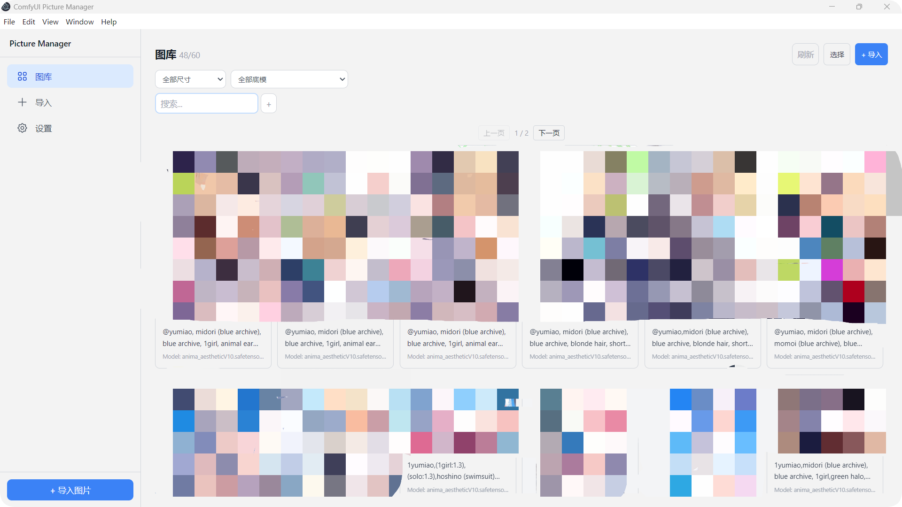
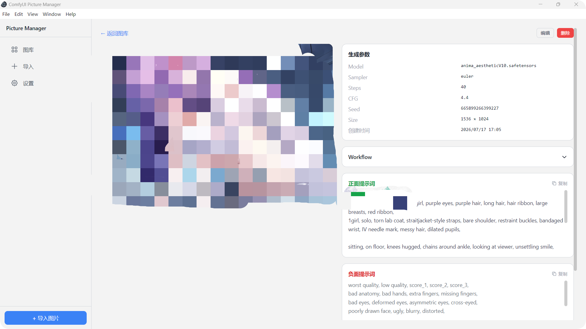
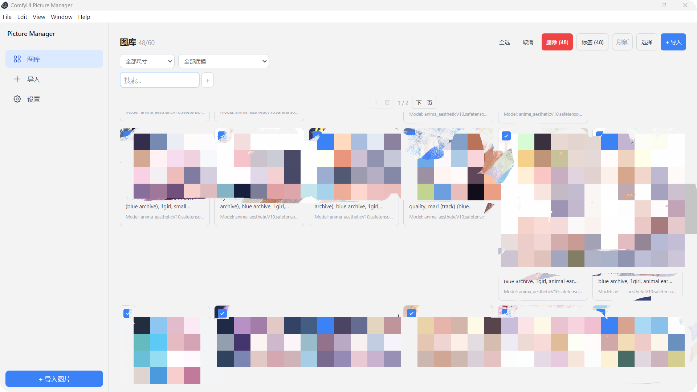
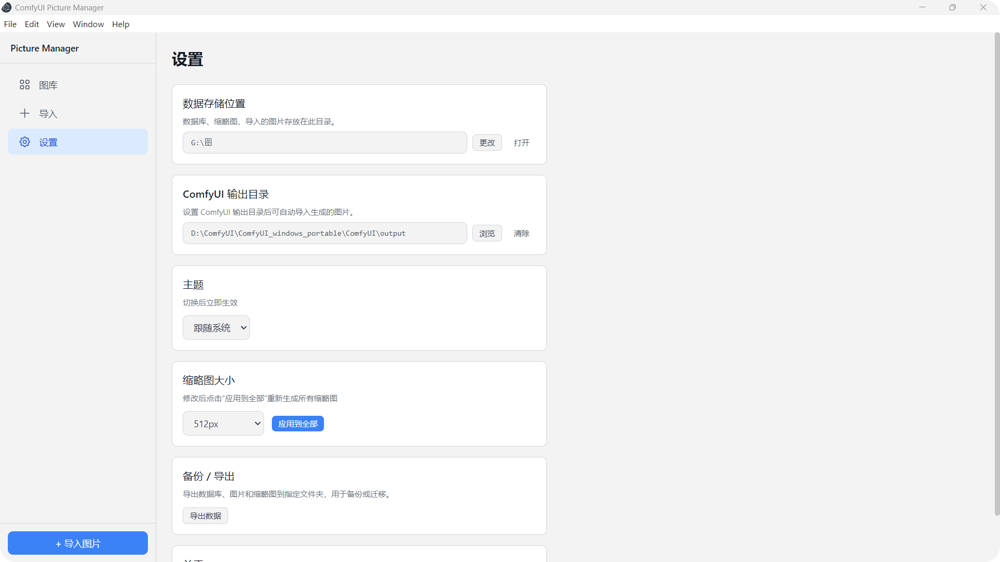

# ComfyUI Picture Manager

Local desktop app for managing ComfyUI generated images, prompts, and generation parameters.
Drag & drop PNGs to auto-extract embedded ComfyUI workflow metadata — no setup, fully offline.

## Features

### Import & Metadata Extraction
- **One-click Import** — Select or drag multiple PNG/JPG/WebP files, auto-copied to managed storage
- **Workflow Metadata** — Reads PNG `tEXt` chunks to extract model, sampler, steps, CFG, seed, positive/negative prompts
- **Full Workflow JSON** — The complete ComfyUI workflow JSON is saved and viewable; copy to clipboard or save as `.json` for reuse in ComfyUI
- **ComfyUI Output Monitoring** — Set your ComfyUI output folder to auto-import newly generated images via `chokidar` file watcher

### Library & Browsing
- **Grid Card View** — Thumbnails with prompt preview, model name, steps, and resolution
- **Pagination** — 48 cards per page with Previous/Next controls
- **Data-driven Resolution Filter** — Resolutions >5% of library appear as primary options, the rest under **Other**
- **Model Filter** — Dropdown of all distinct models in your library
- **Instant Search** — Type to filter by keyword across positive prompt, negative prompt, model, sampler
- **Keyword Chips** — Add multiple `+` chips for AND-intersection filtering; rename or remove chips inline

### Detail View
- **Full-size Image** — Main image + thumbnail carousel for multi-image prompts
- **Generation Parameters** — Model, sampler, steps, CFG, seed, dimensions, creation time
- **Prompt Copy Buttons** — One-click copy positive/negative prompts to clipboard
- **Collapsible Workflow Section** — View formatted JSON, copy to clipboard, or save as `.json` file
- **Keyboard Navigation** — Left/Right arrow keys to flip through images
- **Tag Management** — Add/remove tags directly in the detail page

### Batch Operations
- **Multi-select Mode** — Checkbox selection on each card, Select All, cancel
- **Batch Delete** — Delete multiple prompts and their images at once
- **Batch Tag** — Modal input to tag multiple selected items simultaneously

### Right-click Context Menu
- **View Details** — Jump to prompt detail page
- **Copy Positive Prompt** — Copy to clipboard directly from the library
- **Open File Location** — Open the image in Windows Explorer
- **Delete** — Quick delete with confirmation

### Settings
- **Data Storage Path** — Change where the database and images are stored
- **Theme** — Light / Dark / System, instant switch
- **Thumbnail Size** — 128/256/384/512px, rebuild all thumbnails with progress counter
- **ComfyUI Output Folder** — Configure watch directory for auto-import
- **Backup / Export** — Export database + images + thumbnails to any folder

### Technical
- **Fully Local** — SQLite database (sql.js WASM), no network required
- **Error Boundary** — Graceful error recovery with reload button
- **Scroll Preservation** — Returns to the same scroll position when navigating back from detail view
- **Keyboard Shortcuts** — `Esc` to dismiss context menu / exit select mode / clear filters; `Delete` to batch delete selected

## Screenshots

### Library


### Detail View


### Batch Selection


### Right-click Context Menu


### Settings


## Quick Start

```bash
git clone https://github.com/yuyuanzi001/comfyui-picture-manager.git
cd comfyui-picture-manager
npm install
npm start
```

Or double-click `启动.bat` for one-click build and launch.

**Requirements**: Node.js >= 18, Windows 10/11

## Tech Stack

| Layer | Technology |
|-------|-----------|
| Desktop Framework | Electron 33 |
| Frontend | React 19 + TypeScript |
| Styling | Tailwind CSS 3 |
| State Management | Zustand + React Query |
| Database | SQLite via sql.js (WASM) |
| File Watching | chokidar |
| Image Processing | Electron nativeImage |
| Build (Main) | TypeScript (tsc) |
| Build (Renderer) | Vite 6 |
| Packager | electron-builder (NSIS/dmg/AppImage) |
| Testing | Vitest (12 unit tests) |

## Project Structure

```
src/
├── main/               # Electron main process
│   ├── index.ts        # Window, watcher, startup
│   ├── database.ts     # SQLite init, migrations, parameterized queries
│   ├── ipc/
│   │   ├── index.ts    # Handler registration
│   │   └── handlers/   # app, prompts, tags, images, search
│   ├── migrations/     # Database schema migrations
│   ├── services/       # Shared import logic
│   └── utils/          # PNG metadata parser, thumbnail generator, paths
├── preload/            # contextBridge API
├── renderer/           # React frontend
│   ├── App.tsx         # Router + theme + ErrorBoundary
│   ├── components/
│   │   ├── layout/     # AppShell, Sidebar
│   │   ├── library/    # PromptCard
│   │   └── shared/     # Button, Modal, Toast, EmptyState, Spinner, TextInput, ErrorBoundary
│   ├── hooks/          # usePrompts, useTags
│   ├── lib/            # IPC client, store
│   └── pages/          # LibraryPage, PromptDetailPage, ImportPage, SettingsPage
└── shared/             # TypeScript interfaces & IPC channel constants
```

## License

GPL-3.0 — see [LICENSE](LICENSE)
