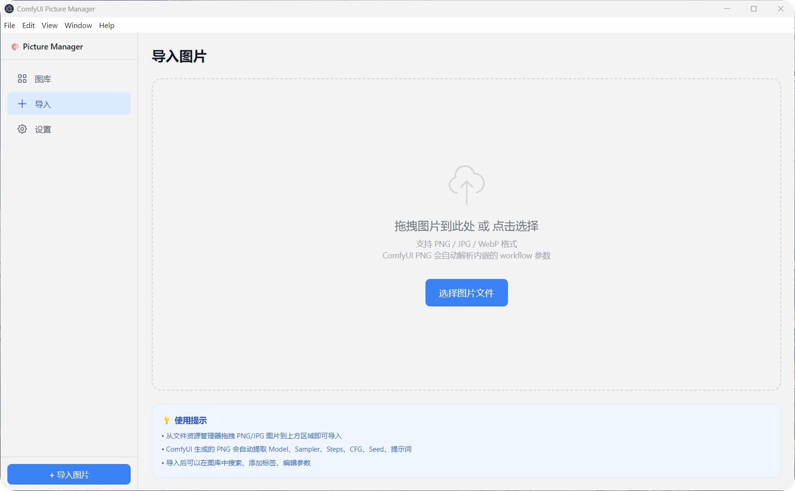
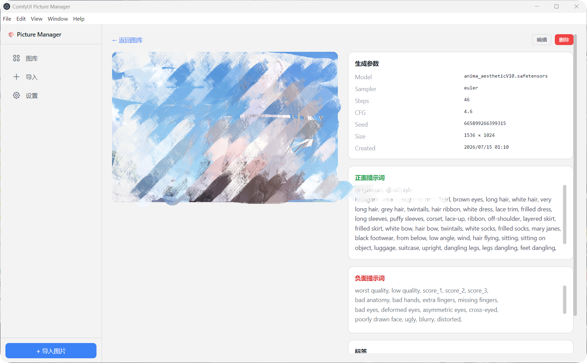
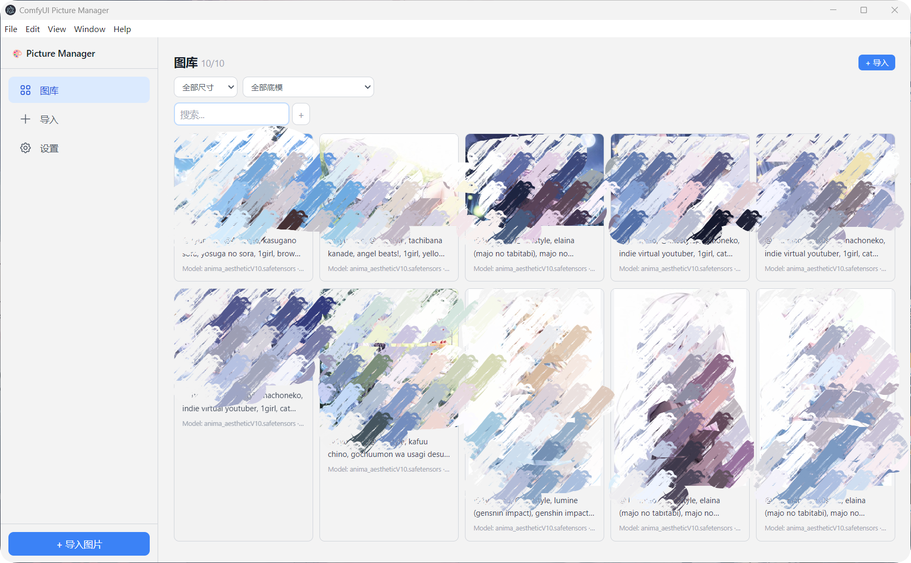

# 🎨 ComfyUI Picture Manager

本地桌面应用，用于管理 ComfyUI 生成的图片和提示词。拖入图片自动解析工作流参数，支持全文搜索、标签分类、分辨率筛选。

## ✨ 功能

- 📥 **一键导入** — 点击选择或拖拽 PNG，自动解析 ComfyUI workflow 内嵌参数
- 🎯 **自动提取** — 读取 PNG tEXt 元数据，提取 model / sampler / steps / CFG / seed / 正负面提示词
- 🔍 **即时搜索** — 输入关键词即时过滤，点 `+` 输入多个关键词取交集
- 🏷️ **标签** — 为图片添加标签，搜索时可叠加筛选
- 📐 **筛选** — 按分辨率、底模下拉框筛选
- 🖼️ **图库浏览** — 网格卡片 + 缩略图 + 大图查看 + 参数 / 提示词详情
- 🌓 **主题切换** — 浅色 / 深色 / 跟随系统，即时生效
- 💾 **纯本地** — 数据存储在 `%APPDATA%\comfyui-picture-manager\`，不联网

## 📸 截图

### 图库浏览


### 导入图片


### 详情查看


## 🚀 快速开始

```bash
git clone https://github.com/yuyuanzi001/comfyui-picture-manager.git
cd comfyui-picture-manager
npm install
npm start
```

或双击 `启动.bat` 一键启动。

**环境要求：** Node.js >= 18，Windows 10/11

## 🏗️ 技术栈

| 层 | 技术 |
|---|---|
| 桌面框架 | Electron |
| 前端 | React 19 + TypeScript |
| 样式 | Tailwind CSS |
| 数据库 | SQLite (sql.js WASM) |
| 图片处理 | Electron nativeImage |
| 构建 | Vite + electron-builder (NSIS) |

## 📁 项目结构

```
src/
├── main/          # Electron 主进程（窗口、数据库、IPC）
├── preload/       # contextBridge API
├── renderer/      # React 前端（页面、组件、hooks）
└── shared/        # 共享类型 & IPC 频道常量
```

## 📄 协议

GPL-3.0 License — 详见 [LICENSE](LICENSE)
